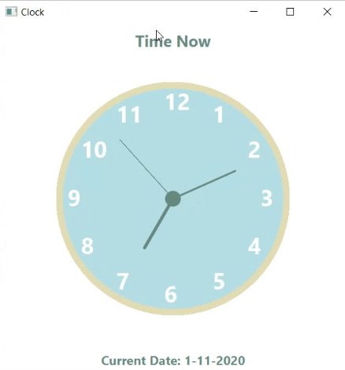

# Clock Java-FX

## Getting Started

Steps to install application:
1. In command line got to clock.jar file 
2. run: java -jar clock.jar

## Site Pictures

* Working app

`` `  


## Code Snippets


1. setStyle();

```java

		currentTime.setStyle("-fx-font-size:20px; -fx-font-weight: bold; -fx-text-fill:rgb(104, 137, 128, 0.99); -fx-padding: 10 0 0 0;");

    
```
* To set the style of the _currentTime_ label, I use _setStyle()_. This allows me to use css for styling the application.


2. Timer

```java

		Timer timer = new Timer();
		TimerTask task = new TimerTask() {
			public void run() {
				Platform.runLater(new Runnable() {
					@Override
					public void run() {
						update();
						renderClockCircle(pane);
						renderHours(pane);
						renderClockArms(pane);
					}
				});
			}
		};
		timer.scheduleAtFixedRate(task, 0, 1000l);

```
* This portion of the code takes care of refreshing the clock every second. It creates a _timer_ and _task_. The _Platform.runLater(new Runnable())_ makes sure that the _run()_ code gets executed. the _timer.scheduleAtFixedRate(task, 0, 1000l);_ calls the task with a delay of 0, every 1000 milliseconds.


## Built With

* [Java](https://java.com/en/download/faq/develop.xml)
* [JavaFX](https://openjfx.io/)
* [Eclipse](https://www.eclipse.org/)


## Author

 * **Carlos Toledo** 

## Links

- [Link to site repository](https://github.com/kqarlos/clock-javafx)
- [Link to Github](https://www.github.com/kqarlos)
- [Link to LinkedIn](https://www.linkedin.com/in/carlos-toledo415/)

